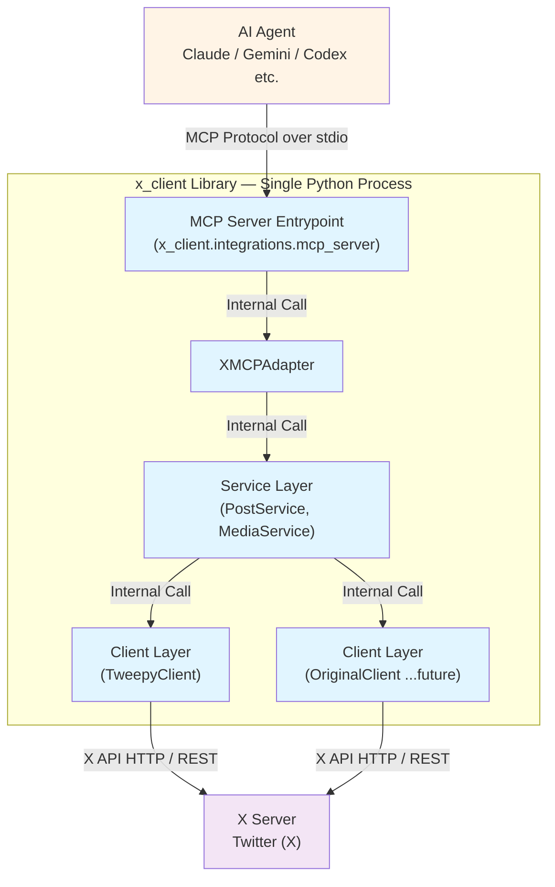

# X (Twitter) API Client

This is a Python client for integrating with the X (Twitter) API. You can operate the X API from AI assistants (such as Claude, Gemini, etc.) via MCP.

## Role of this Library

This library is a **client for the X API**. Although it also functions as an MCP server, the name `x_client` means it is a client for the X (Twitter) server.



**Clarification of Roles**:
- **AI Agent (MCP Client)**: AI assistants like Claude Code, Claude Desktop, Gemini.
- **MCP Server**: The MCP protocol-compatible server provided by this library.
- **X Client**: The core function of this library. A client for the X API.
- **X Server**: The main server of Twitter/X.

In other words, this library has two faces:
1.  **From the MCP perspective**: It acts as an MCP **server** providing tools to AI agents.
2.  **From the X API perspective**: It acts as an X API **client** communicating with the X server.

It is also possible to use the X API as a library without MCP (see bottom of README.md).

## Requirements
- Python 3.11 or higher
- X (Twitter) developer account and a set of API keys
- Package management tool [uv](https://docs.astral.sh/uv/) (recommended)

## Usage with MCP (Model Context Protocol)

You can operate the X API from AI assistants (such as Claude Code, Claude Desktop, codex-cli, Gemini, etc.).

### 🚀 Recommended Setup: Unified Execution with uvx

By using **uvx** in all environments, you can get automatic dependency management and always stay up-to-date.

### Configuration

Describe the following in the MCP configuration file of each AI tool:

**TOML format (Codex-CLI, etc.)**:
*   Published on PyPI
```toml
[mcp.servers.x_client]
command = "uvx"
args = ["--from", "pyx-mcp", "x-mcp-server"]

[mcp.servers.x_client.env]
X_API_KEY = "your-api-key"
X_API_SECRET = "your-api-secret"
X_ACCESS_TOKEN = "your-access-token"
X_ACCESS_TOKEN_SECRET = "your-access-token-secret"
```

*   Latest from GitHub
```toml
[mcp.servers.x_client]
command = "uvx"
args = ["--from", "git+https://github.com/hellocybernetics/pyX-MCP", "x-mcp-server"]

[mcp.servers.x_client.env]
X_API_KEY = "your-api-key"
X_API_SECRET = "your-api-secret"
X_ACCESS_TOKEN = "your-access-token"
X_ACCESS_TOKEN_SECRET = "your-access-token-secret"
```

**JSON format (Claude Code, Gemini CLI, etc.)**:
*   Published on PyPI
```json
{
  "mcpServers": {
    "x_client": {
      "command": "uvx",
      "args": ["--from", "pyx-mcp", "x-mcp-server"],
      "env": {
        "X_API_KEY": "your-api-key",
        "X_API_SECRET": "your-api-secret",
        "X_ACCESS_TOKEN": "your-access-token",
        "X_ACCESS_TOKEN_SECRET": "your-access-token-secret"
      }
    }
  }
}
```
*   Latest from GitHub
```json
{
  "mcpServers": {
    "x_client": {
      "command": "uvx",
      "args": ["--from", "git+https://github.com/hellocybernetics/pyX-MCP", "x-mcp-server"],
      "env": {
        "X_API_KEY": "your-api-key",
        "X_API_SECRET": "your-api-secret",
        "X_ACCESS_TOKEN": "your-access-token",
        "X_ACCESS_TOKEN_SECRET": "your-access-token-secret"
      }
    }
  }
}
```

### Configuration File Locations

- **Claude Code**: `mcp_settings.json`
- **codex-cli**: Configuration file (TOML/JSON)
- **Claude Desktop**:
  - macOS: `~/Library/Application Support/Claude/claude_desktop_config.json`
  - Windows: `%APPDATA%\Claude\claude_desktop_config.json`
  - Linux: `~/.config/Claude/claude_desktop_config.json`
- **Gemini**: `~/.gemini/mcp_config.json` (or Gemini specified path)

**Important**: Please restart your AI tool completely after setting it up.

### Operation Check

Ask your AI assistant as follows:

```
"List the available X API tools"
```

or

```
"Post 'Hello from MCP!'"
```

### Benefits of uvx setup

- ✅ **Environment Independent**: No Node.js required, works only with a Python environment
- ✅ **Automatic Dependency Management**: uv automatically builds and caches virtual environments
- ✅ **Always Up-to-date**: `--from pyx-mcp` automatically gets the latest version from PyPI
- ✅ **Unified Configuration**: Same configuration method for all AI assistants

---

## Provided Features

The following tools are available via MCP:

### Posting Features
- **create_post**: Text posts, posts with images/videos, replies, quote posts
- **delete_post**: Delete a post
- **get_post**: Get a post by its ID
- **create_thread**: Automatically split long text into a thread post

### Repost Features
- **repost_post**: Repost a post
- **undo_repost**: Undo a repost

### Search Features
- **search_recent_posts**: Search for posts from the last 7 days (with author information)

### Media Upload
- **upload_image**: Upload an image (JPEG/PNG/WebP/GIF, max 5MB)
- **upload_video**: Upload a video (MP4, max 512MB, chunked upload supported)

### Authentication and Status Check
- **get_auth_status**: Get authentication status and rate limit information

### Usage Examples

```
You: "Post 'Hello from Claude via MCP!'"

Claude: Using the create_post tool...
       Post completed! Post ID: 1234567890
```

```
You: "Search for recent posts about 'MCP protocol'"

Claude: Using the search_recent_posts tool...
       Found 3 posts:
       1. @user1: I tried using MCP...
       2. @user2: Model Context Protocol is...
```

### Architecture

```
AI Assistant ↔ MCP Server (stdio) ↔ XMCPAdapter ↔ Service Layer ↔ X API
```

### Error Handling

- **ConfigurationError**: Missing authentication information. Check `.env` and environment variables.
- **AuthenticationError**: Token expired. Re-run the OAuth flow.
- **RateLimitExceeded**: Rate limit reached. Back off with reference to `reset_at`.
- **MediaProcessingTimeout/Failed**: Timed out waiting for video processing to complete. Adjust `timeout` and video quality.

### Troubleshooting

- **Missing credentials**: Check environment variables with `echo $X_API_KEY`. Check if `.env` is saved with `0o600`.
- **Invalid token**: Re-run the OAuth flow to update authentication information.
- **Video timeout**: Extend the `timeout` of `upload_video` or re-encode with `ffmpeg`.

---

## Using as a Library

It can also be called directly from Python code.

### Installation

```bash
uv add pyx-mcp
```

### How to get authentication information

To use this library, you need to get the following four pieces of authentication information from your X (Twitter) developer account.

1.  **Access the X Developer Portal**:
    -   Go to [https://developer.x.com/en/portal/dashboard](https://developer.x.com/en/portal/dashboard) and log in.

2.  **Select or create an application**:
    -   Select an existing application or create a new one.

3.  **Check keys and tokens**:
    -   On the application dashboard, go to the "Keys and Tokens" tab.

4.  **Generate and set permissions**:
    -   **API Key and Secret**: Check or regenerate in the "Consumer Keys" section.
    -   **Access Token and Secret**: In the "Authentication Tokens" section, generate an access token and secret with **Read and Write** permissions.

Set these retrieved values in the environment variables or `.env` file described below.

## Setting Authentication Information

Set the authentication information with environment variables or an `.env` file:

```bash
export X_API_KEY="your_api_key"
export X_API_SECRET="your_api_secret"
export X_ACCESS_TOKEN="your_access_token"
export X_ACCESS_TOKEN_SECRET="your_access_token_secret"
export X_BEARER_TOKEN="your_bearer_token"  # for v2 API (optional)
```

Or in an `.env` file (placed in the project root):
```bash
X_API_KEY=your_api_key
X_API_SECRET=your_api_secret
X_ACCESS_TOKEN=your_access_token
X_ACCESS_TOKEN_SECRET=your_access_token_secret
X_BEARER_TOKEN=your_bearer_token
```

`.env` is automatically set to `0o600` (owner read/write only). `.env*` is `.gitignore`d.

---

### Basic Usage

```python
from x_client.config import ConfigManager
from x_client.factory import XClientFactory
from x_client.services.post_service import PostService
from x_client.services.media_service import MediaService

# 1. Load authentication information
config = ConfigManager()
client = XClientFactory.create_from_config(config)

# 2. Initialize the service layer
post_service = PostService(client)
media_service = MediaService(client)

# 3. Create a post
post = post_service.create_post(text="Hello from x_client!")
print(f"Post created: {post.id}")

# 4. Post with an image
from pathlib import Path
media_result = media_service.upload_image(Path("image.png"))
post = post_service.create_post(
    text="Check out this image!",
    media_ids=[media_result.media_id]
)

# 5. Post a long thread
thread = post_service.create_thread(
    '''Python 3.11 highlights... (long text)''',
    chunk_limit=200,
)
for idx, segment_post in enumerate(thread.posts, start=1):
    print(f"Segment {idx}: {segment_post.id}")
if not thread.succeeded:
    print("Thread failed", thread.error)

# 6. Repost operation
repost_state = post_service.repost_post(post.id)
print("Reposted:", repost_state.reposted)

undo_state = post_service.undo_repost(post.id)
print("Repost removed:", not undo_state.reposted)

# 7. Search with author information
search_results = post_service.search_recent(
    "from:twitterdev",
    expansions=["author_id"],
    user_fields=["username", "verified"],
    post_fields=["created_at"],
)
for item in search_results:
    author = item.author.username if item.author else "unknown"
    print(author, item.text)
```

### Usage via MCP Adapter (a simplified version of the above API)

It can also be called directly from other than MCP clients:

```python
from x_client.integrations.mcp_adapter import XMCPAdapter

adapter = XMCPAdapter()  # Authentication information is automatically loaded by ConfigManager

post = adapter.create_post({"text": "Hello from MCP!"})
print(post)

media = adapter.upload_image({"path": "/path/to/image.png"})
adapter.create_post({"text": "Image post", "media_ids": [media["media_id"]]})
```

### Logging and Observability

`PostService` has structured logging and event hooks built in:

```python
import logging
from x_client.config import ConfigManager
from x_client.factory import XClientFactory
from x_client.services.post_service import PostService

logging.basicConfig(level=logging.INFO)

client = XClientFactory.create_from_config(ConfigManager())

def metrics_hook(event: str, payload: dict[str, object]) -> None:
    # Integration point for Prometheus / OpenTelemetry, etc.
    print("metrics", event, payload)

post_service = PostService(client, event_hook=metrics_hook)
post_service.create_post("observability ready!")
```

The event hook consolidates both success and failure into a single callback, making it easy to send metrics and integrate with distributed tracing.

---

## Usage in a Development Environment

### Setup

```bash
cd /path/to/twitter
uv pip install -e .
```

This will create the `x-mcp-server` command in `.venv/bin/`.

### Running the MCP Server with a Local Path

To run the MCP server under development directly:

```json
{
  "mcpServers": {
    "x-client": {
      "command": "/absolute/path/to/twitter/.venv/bin/x-mcp-server",
      "env": {
        "X_API_KEY": "your-api-key",
        "X_API_SECRET": "your-api-secret",
        "X_ACCESS_TOKEN": "your-access-token",
        "X_ACCESS_TOKEN_SECRET": "your-access-token-secret"
      }
    }
  }
}
```

<details>
<summary>Alternative methods (click to expand)</summary>

**Method 2: Direct use of uv**
```json
{
  "mcpServers": {
    "x-client": {
      "command": "uv",
      "args": ["run", "--directory", "/absolute/path/to/twitter", "python", "-m", "x_client.integrations.mcp_server"],
      "env": {
        "X_API_KEY": "your-api-key",
        "X_API_SECRET": "your-api-secret",
        "X_ACCESS_TOKEN": "your-access-token",
        "X_ACCESS_TOKEN_SECRET": "your-access-token-secret"
      }
    }
  }
}
```

**Method 3: Launcher script**
```json
{
  "mcpServers": {
    "x-client": {
      "command": "/absolute/path/to/twitter/scripts/run_mcp_server.sh",
      "env": { "X_API_KEY": "...", "X_API_SECRET": "...", "X_ACCESS_TOKEN": "...", "X_ACCESS_TOKEN_SECRET": "..." }
    }
  }
}
```
</details>

**Important**: Replace `/absolute/path/to/twitter` with the actual project path.

---

## Usage with CLI

You can easily post from the command line using `examples/create_post.py`.

### Basic Usage

```bash
# Text only
python examples/create_post.py "Hello from x_client!"

# With image
python examples/create_post.py "Check out this image!" --image path/to/image.png

# With video (max 512MB, chunked upload supported)
python examples/create_post.py "Check out this video!" --video path/to/video.mp4

# Use .env from a different path
python examples/create_post.py "Hello with custom env" --dotenv /secure/path/.env
```

### Thread Posting

```bash
# Long thread post (auto-split with chunk_limit=180)
python examples/create_post.py "Long form update..." --thread --chunk-limit 180

# Post a thread from a file (assuming UTF-8 text)
python examples/create_post.py --thread-file docs/thread_draft.txt

# Example of a long Japanese thread (break lines appropriately under 280 characters)
python examples/create_post.py --thread-file examples/long_thread_ja.txt --chunk-limit 180

# Example of a long English thread (maintaining sentence breaks)
python examples/create_post.py --thread-file examples/long_thread_en.txt --chunk-limit 240

# Wait 8 seconds between each post to avoid rate limits
python examples/create_post.py --thread-file examples/long_thread_en.txt --segment-pause 8
```

### Other Operations

```bash
# Delete the first tweet of a failed thread (used to resolve duplicate errors)
python examples/create_post.py --delete 1234567890123456789

# Repost / Undo repost
python examples/create_post.py --repost 1234567890
python examples/create_post.py --undo-repost 1234567890
```

### Language-specific considerations

- **Japanese**: If there are many full-width characters, filling up to the 280-character limit can make it difficult to read, so keep `--chunk-limit` to around 150-200 characters to maintain chunks for each phrase. Also, since splitting immediately after a punctuation mark can break the context, it is safe to insert a blank line for each paragraph on the text file side.

- **English**: When including URLs or emojis, Twitter counts them as 23 characters, so set `--chunk-limit` with a margin. If you add a line break for each sentence, it will be easier to read after splitting.

### Notes

- When re-posting a thread, if you post the exact same body text within 24 hours, you will get a **Duplicate content** error due to X's specifications. Please delete the previously posted thread or add a unique phrase such as a timestamp to the text.

- The X API may return HTTP 429 (Too Many Requests) if you post continuously in a short period of time. This library detects `RateLimitExceeded` and waits according to `x-rate-limit-reset` in the response header before retrying, but if a 429 occurs, please wait 2-3 minutes before re-executing the command. Setting `--segment-pause` to about 5–10 seconds makes it easier to avoid 429 in advance.


---

## Tests

```bash
# Test MCP server operation
uv run python scripts/test_mcp_server.py

# Unit tests
uv run pytest tests/unit/test_mcp_adapter.py -v

# Run all tests
uv run pytest

# Run with coverage
uv run pytest --cov=x_client --cov-report=html

# Verbose mode
uv run pytest -v

# Specific test file
uv run pytest tests/unit/test_tweepy_client.py
```

---

## Main Features

- Dual client configuration: tweepy.Client (v2) for posts, tweepy.API (v1.1) for media
- Secure authentication information management using `.env` and OAuth flow integration
- High-level API with `PostService` / `MediaService`
- Long thread posting utility and automatic reply chain construction
- Repost/undo API and MCP tools
- Support for specifying expansions/fields in the search API and resolving author information
- Structured logging and event hooks built into the service layer
- Operation from AI assistants via MCP (Model Context Protocol) integration


---

## Support

Please report bugs and suggestions for improvement via issues or pull requests. For details on project policies and design, please refer to `docs/` and add comments as necessary.
